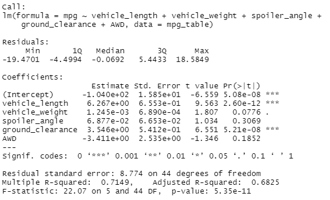
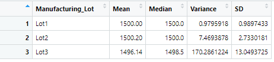
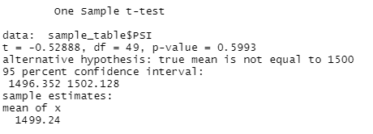
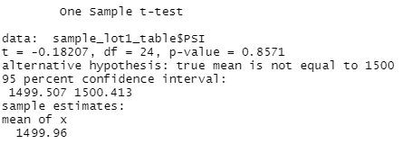
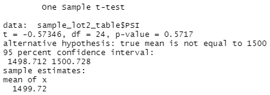
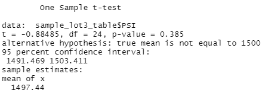

# MechaCar_Statistical_Analysis
## Purpose and Objective
The objective of this challenge was to utilize the R programming language to perform statistical analyses on a dataset containing automotive miles per gallon (MPG) information for 50 different prototype MechaCars(tm) as well as a dataset with production information for suspension coils produced in distinct production lots. Hypothesis testing was also used as part of the statistical analysis. <br><br> All programming was performed in RStudio using R version 4.1.2.

## Results
### Deliverable 1: Linear Regression to Predict MPG
<kbd></kbd>
- We find that vehicle length and ground clearance variables both present a statistically significant (p<0.001) amount of variance to the MPG values found in the dataset. In addition, the intercept is statistically significant (p<0.001) and provides a non-random amount of variance to the MPG values. The multi-linear model is as follows:<br>```mpg = 6.27*vehicle_length + 1.25e-3*vehicle_weight + 6.88e-2*spoiler_angle + 3.55*ground_clearance - 3.41*AWD - 1.40e-2```
- We can conclude that the slope of the linear model is not zero based upon the p-value of 5.35e-11 for the linear regression analysis, which is much lower than the 0.05% assumed significance level. This allows us to reject the null hypothesis and conclude the slope is not zero.
- We find that this linear model presents a strong correlation between the linear model and MPG of MechaCar Protitypes. The linear model predicts 71.5% of the variance in MPG based on a relatively limited number of measurements per each prototype car. 

### Deliverable 2: Summary Statistics on Suspension Coils
**Summary of All Suspension Coils**<br>
<kbd></kbd>

**Summary of Suspension Coils by Manufacturing Lot**<br>
<kbd></kbd>

- The summary table of all suspension coils shows that the entire supply falls within the dictated variance threshold for suspension coils of 100 pounds per square inch (PSI), with variance of 63.2 PSI.
- When the suspension coils are divided by manufacturing lots, we see that there is non-trivial differentiation between the lots and their specifications. The variances for Lots 1 (0.98 PSI) and 2 (7.47 PSI) fall well within the acceptable range, but Lot 3 has a variance of 170.29 PSI which is well outside the acceptable threshold of 100 PSI. Some review should be performed of the starting materials, processes, and machinery used in Lot 3 to better understand what has caused such inconsistency in the suspension coils.

### Deliverable 3: t-Tests on Suspension Coils
**t-Test of All Suspension Coils vs. Population Mean of 1500 PSI**<br>
<kbd></kbd>

- The mean PSI of a sample of all suspension coils was found to be 1499.24 PSI. A t-test comparing all suspension coils to the stated 1500 PSI population mean found no statistically significant difference (p=0.5993) between the measured mean PSI and the specification for the population PSI. The null hypothesis cannot be rejected, indicating that sampling introduced no variance compared to the entire set of suspension coils. 
- _NOTE: It should be pointed out that the mean of the entire set was not 1500 PSI but rather 1498.78 PSI. If the intent was to present all t-tests compared to the true mean value, those calculations have been commented out in the code and can be quickly included. They will have no impact on the statistical significance of the results._

**t-Test of Lot 1 Suspension Coils vs. Population Mean of 1500 PSI**<br>
<kbd></kbd>

- A t-test of the mean PSI of a sample of half the Lot 1 suspension coils compared to the population mean of 1500 PSI demonstrates a p-value of 0.86, indicating that we cannot reject the null hypothesis at a significance threshold of 0.05%. We can conclude there is no measureable variance between Lot 1 and the population mean.

**t-Test of Lot 2 Suspension Coils vs. Population Mean of PSI**<br>
<kbd></kbd>

- A t-test of the mean PSI of a sample of half the Lot 2 suspension coils compared to the population mean of 1500 PSI demonstrates a p-value of 0.57, indicating that we cannot reject the null hypothesis at a significance threshold of 0.05%. We can conclude there is no measureable variance between Lot 2 and the population mean.

**t-Test of Lot 3 Suspension Coils vs. Population Mean of 1500 PSI**<br>
<kbd></kbd>

- A t-test of the mean PSI of a sample of half the Lot 3 suspension coils compared to the population mean of 1500 PSI demonstrates a p-value of 0.39, indicating that we cannot reject the null hypothesis at a significance threshold of 0.05%. We can conclude there is no measureable variance between Lot 3 and the population mean.

### Deliverable 4: Study Design: MechaCar vs Competition
Write a short description of a statistical study that can quantify how the MechaCar performs against the competition. In your study design, think critically about what metrics would be of interest to a consumer: for a few examples, cost, city or highway fuel efficiency, horse power, maintenance cost, or safety rating.

In your description, address the following questions:
- What metric or metrics are you going to test?
- What is the null hypothesis or alternative hypothesis?
- What statistical test would you use to test the hypothesis? And why?
- What data is needed to run the statistical test?
